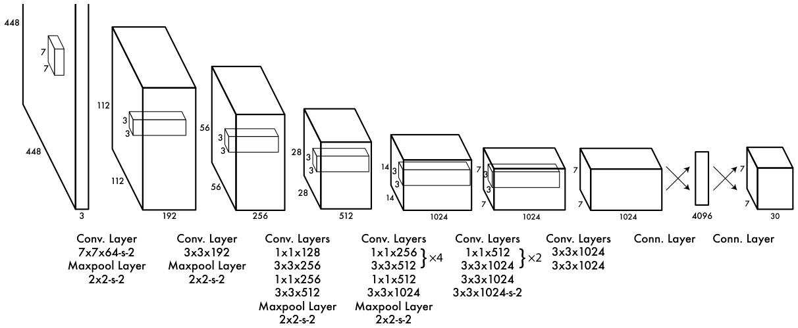

# Veinticuatro convoluciones y dos capas conectadas

La red de detección tiene 24 capas convolucionales seguidas de 2 capas totalmente conectadas. Las capas convolucionales extraen características de la imagen y las capas conectadas predicen las probabilidades y las coordenadas. El diseño se inspira en GoogLeNet, pero en lugar de módulos *inception* usa reducciones 1 × 1 seguidas de convoluciones 3 × 3.



> Doc: [YOLO, sección 2.1 y figura 3](https://arxiv.org/abs/1506.02640)

En la figura, `7x7x64-s-2` se lee como 64 filtros de 7 × 7 con paso (*stride*) 2, y `Maxpool Layer 2x2-s-2` como un agrupamiento por máximo (*max pooling*) de 2 × 2 con paso 2.

# El tamaño espacial tras una capa

Una capa con ventana `k`, paso `s` y relleno (*padding*) `p` transforma un lado de `n` píxeles en `(n + 2p - k) // s + 1`. Las dimensiones de la figura 3 implican un relleno que conserva el tamaño salvo por el paso: la primera convolución lleva 448 a 224 y el primer agrupamiento, 224 a 112.

```python
def lado_salida(n, k, s, p):
    return (n + 2 * p - k) // s + 1

despues_conv = lado_salida(448, 7, 2, 3)
despues_pool = lado_salida(despues_conv, 2, 2, 0)
print(despues_conv, despues_pool)
```

```salida
224 112
```

> Nota: El artículo no publica el relleno de cada capa. El valor `p = 3` para la ventana de 7 × 7 se deduce de que la figura muestra 112 tras la primera convolución y el primer agrupamiento.

# Recorrer las reducciones de resolución

La resolución solo cambia en las capas con paso 2: la primera convolución, los cuatro agrupamientos por máximo y la convolución `3x3x1024-s-2`. Seis reducciones a la mitad dividen el lado entre 64.

```python
lado = 448
reducciones = ["conv 7x7 s2", "maxpool", "maxpool",
               "maxpool", "maxpool", "conv 3x3 s2"]
for capa in reducciones:
    lado //= 2
    print(capa, lado)
```

```salida
conv 7x7 s2 224
maxpool 112
maxpool 56
maxpool 28
maxpool 14
conv 3x3 s2 7
```

> Nota: La reducción total `448 / 7 = 64` coincide con el lado de una celda de la sesión 5. Cada posición del mapa final de 7 × 7 se corresponde con una celda de la cuadrícula.

# Contar las capas convolucionales

La figura 3 agrupa las convoluciones en seis bloques. Los factores `×4` y `×2` indican que un par de capas se repite cuatro y dos veces.

```python
bloques = [
    ["7x7x64-s-2"],
    ["3x3x192"],
    ["1x1x128", "3x3x256", "1x1x256", "3x3x512"],
    ["1x1x256", "3x3x512"] * 4 + ["1x1x512", "3x3x1024"],
    ["1x1x512", "3x3x1024"] * 2 + ["3x3x1024", "3x3x1024-s-2"],
    ["3x3x1024", "3x3x1024"],
]
print([len(bloque) for bloque in bloques])
print(sum(len(bloque) for bloque in bloques))
```

```salida
[1, 1, 4, 10, 6, 2]
24
```

```ejercicio
# Enunciado
Completa el número de reducciones a la mitad que llevan 448 píxeles a 7.

# Plantilla
lado = 448
for _ in range(___):
    lado //= 2
print(lado)

# Esperado
7

# Pista
448 / 7 = 64, y 64 es una potencia de 2.
```

# Cierre

La red reduce 448 × 448 × 3 a un mapa de 7 × 7 × 1024 mediante 24 convoluciones y seis reducciones a la mitad; dos capas conectadas producen después el tensor de 7 × 7 × 30. La sesión siguiente implementa las convoluciones 3 × 3 y las reducciones 1 × 1.
